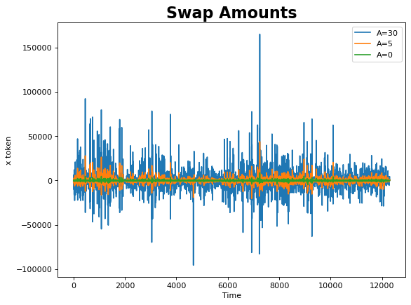

# ARC-10: Scale Amplification for the bLUNA-LUNA Pool

## Preamble

```
AIP#: 10
Title: Scale Amplification for the bLUNA-LUNA Pool
Author(s): @tatyana
Contributors: n/a
Tags: technical
Category: Binding (Executable Purely On-Chain)
Status: Deferred
Date Proposed: 2022-03-31
Date Ratified:
Dependencies: n/a
Replaces: n/a
License: GNU General Public License v3.0
```

## References

https://arxiv.org/abs/2103.12732

https://alvarofeito.com/articles/curve/#Making-a-Curve-trade

https://gov.curve.fi/t/a-parameter-research-demo-and-code/1622

https://arxiv.org/pdf/2003.10001.pdf

## Summary

In this post, we propose a methodology for determining the optimal value of the amplification parameter that is used in Astroport’s stableswap pools.

Based on this methodology we propose to increase the amplification parameter for the bLUNA/LUNA pool from 10 to 30.

## Abstract

The Amplification coefficient (A) is a hyperparameter of the stableswap formula that defines the tradeoff between constant sum and constant product functions. In this way, the stableswap formula tries to achieve a compromise between low slippage and a balanced pool.

In Astroport, the A parameter is defined by the pool creators, and can be changed through a governance vote. Here we propose a methodology to determine an optimal value for the A parameter based on historical swap transactions, the corresponding token prices, and their effect on pool balances.

## Motivation

The stableswap formula used in the Astroport is a combination of constant sum and constant-product functions:


where x, y are the token amounts, C is the total number of tokens when they have an equal price and A is the amplification parameter that establishes the trade-off between the two functions.

When A→inf, the stableswap formula is a constant-sum one with constant exchange rate equal to 1. When A → 0, the stableswap formula boils down to a constant-product one.

The exchange rate of the pair of tokens can be defined as a gradient of the stableswap formula or, in the limit of small trades, the derivative:


The constant sum (linear-invariant) function implies no slippage but can lead to running out of tokens. The product invariant function leads to greater slippage, but makes it expensive to bring the pool out of balance. Lastly, the curve allows the exchange rate to deviate from 1 to reflect supply-demand dynamics while simultaneously keeping the slippage low.

In that way the curve tries to achieve a balance between low slippage and a balanced pool. For that to be the case, though, an adequate amplification parameter needs to be determined for the pool. In the next section we propose a methodology for doing this that intends to promote the aforementioned balance for stableswap pools within Astroport.

## Specification

The price in AMM-based pools usually fluctuates around the fair market price. If the price in the pool differs significantly from the market price, arbitrage opportunities arise that in an efficient market are quickly discovered and eliminated by market participants.

Therefore, it is reasonable to assume that whatever parameter A is set, the price in the pool is likely to tend towards its average market value.

Since the price in an AMM-based pool can be calculated as the tangent to the curve at a given point, for a given market price and A parameter we can determine which point of the curve it corresponds to using the stableswap formula and its derivative

Specifically, for bLUNA/LUNA the average market price is about 0.98. The figure below shows, for different values of A, the pool balance (x, y) that correspond to that average market price. As can be seen, the higher the A, the more unbalanced the pool is at the 0.98 price.


As was mentioned before, the A parameter should be set to achieve a balance between low slippage and a balanced pool. The previous figure showed that the lower the A, the more balanced the pool. However, the lower the A the more slippage traders will experience, as will be shown in the analysis below.

Using historical data for the bLUNA/LUNA pool on Terraswap, we calculate, for different values of A, the swap amounts required under a stableswap pool that would achieve the same prices as in the constant product Terraswap pool. The following figure summarizes the results and basically shows that, the higher the A, the lower the slippage or, in other words, the larger the trade size required to achieve the same price levels as in the constant product Terraswap pool.



Lastly, the pool balance was calculated over the time as follows:


According to this formula the perfect balance is 1 and complete imbalance (all coins held in one token) is 0.

The pool balance under different A is provided in the figure below.


The relationship between the average and the minimum pool balances and the A parameter is shown in the figure below.


The above analysis further confirms that increases in A can lead to high pool imbalances.

Thus, to achieve the right balance between low slippage and balanced pools we propose to set the parameter A at the level that corresponds to a given average and minimum balance in the pool.

Particularly for the bLUNA/LUNA pool we consider an acceptable average balance to be 80% (which corresponds to minimum balance of 60%), which leads to an amplification coefficient of 30.

### Proposed Code

A [Jupyter notebook](https://github.com/astroport-fi/astro-stableswap-research/blob/main/bluna_pool/amplification_research_bLUNA_LUNA.ipynb) is provided with the calculations mentioned above.

### Test Cases

None, as there is no new smart contract code to add.

### Security Considerations

The methodology proposed above should be reviewed by the community for several weeks before the bLUNA-LUNA amplification can be scaled.

Also, an important note: the stableswap pool code in Astroport treats A as A/2, meaning that an A of 30 should be set to 60 in the smart contract.

### Licensing

GNU General Public License v3.0
